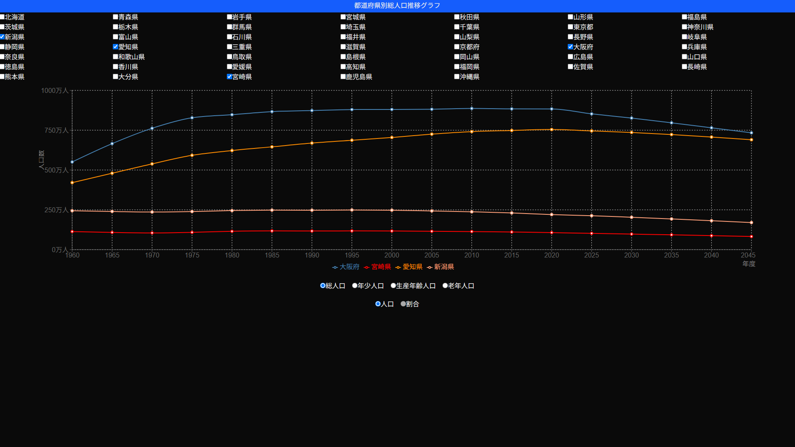

# 株式会社ゆめみ フロントエンドコーディング試験

## 最初に
テストツール/テストコードの作成は出来ませんでした。

## 概要
このプロジェクトは、都道府県を選び、選んだ都道府県の人口推移をグラフで表示するWebアプリです。

NextJSとTailwindCSSでUIを構築、グラフにはRechartsを使用しています。



## ディレクトリ構成
```bash
├─app
│  │  favicon.ico
│  │  globals.css
│  │  layout.tsx
│  │  page.tsx
│  │
│  └─api
│      ├─population
│      │      route.ts
│      │
│      └─prefectures
│              route.ts
│
├─components
│  │  PopulationTrendApp.tsx
│  │
│  ├─PopulationGraph
│  │  │  PopulationGraph.tsx
│  │  │
│  │  ├─GraphManager
│  │  │      GraphManager.tsx
│  │  │
│  │  └─Options
│  │          GraphOptions.tsx
│  │          YAxisOptions.tsx
│  │
│  └─PrefectureCheckBox
│          PrefectureCheckBox.tsx
│
├─hooks
│      useGraphData.ts
│      usePopulationData.ts
│
├─types
│      types.ts
│
└─utils
        colors.ts
        population-api.ts
        prefecture-api.ts
```

## 使用技術
フロントエンド
- NextJS 15
- React 19
- TailwindCSS 4
- TypeScript

データフェッチ : SWR

グラフ : Recharts

リンタ : ESLint

フォーマッタ : Prettier

テストツール : PlayWright

パッケージ管理 : yarn
